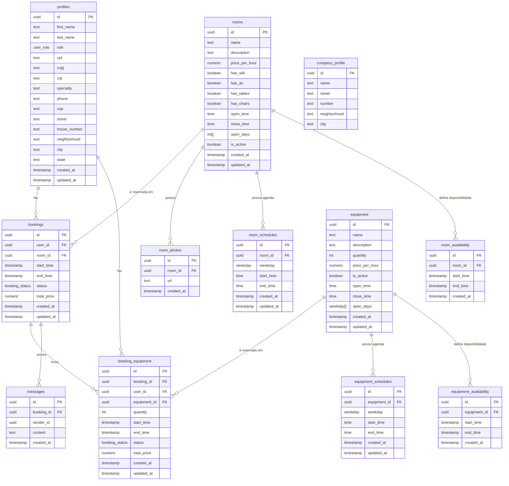

# Diagrama Entidade-Relacionamento (ER)

Este documento apresenta o diagrama de entidade-relacionamento (ER) do sistema de reservas, detalhando as relações entre as diferentes tabelas do banco de dados.

## Diagrama ER Completo

## Descrição das Relações

### Perfis e Reservas

- Um perfil (usuário) pode fazer múltiplas reservas de salas
- Um perfil pode fazer múltiplas reservas de equipamentos
- Um perfil é identificado por um ID único que referencia auth.users

### Salas e Reservas

- Uma sala pode ser reservada múltiplas vezes
- Uma sala pode ter múltiplas fotos
- Uma sala tem um cronograma de disponibilidade semanal (room_schedules)
- Uma sala pode ter períodos específicos de disponibilidade (room_availability)

### Equipamentos e Reservas

- Um equipamento pode ser reservado múltiplas vezes
- Um equipamento tem um cronograma de disponibilidade semanal (equipment_schedules)
- Um equipamento pode ter períodos específicos de disponibilidade (equipment_availability)

### Reservas e Equipamentos

- Uma reserva de sala pode incluir múltiplos equipamentos adicionais
- Equipamentos podem ser reservados independentemente (booking_equipment com booking_id nulo)
- Uma reserva pode ter múltiplas mensagens associadas

### Perfil da Empresa

- A tabela company_profile armazena informações sobre a empresa/clínica que gerencia o sistema
- É uma tabela singleton (normalmente contém apenas um registro)

## Observações Importantes

1. **Chaves Estrangeiras**: As relações entre tabelas são mantidas por chaves estrangeiras que garantem a integridade referencial dos dados.

2. **Tabelas de Agendamento**: As tabelas de agendamento (room_schedules, equipment_schedules) definem os horários regulares de disponibilidade por dia da semana.

3. **Tabelas de Disponibilidade**: As tabelas de disponibilidade (room_availability, equipment_availability) definem exceções ou períodos específicos de disponibilidade.

4. **Reservas Independentes de Equipamentos**: A tabela booking_equipment pode representar tanto equipamentos adicionais associados a uma reserva de sala (booking_id preenchido) quanto reservas independentes de equipamentos (booking_id nulo).

5. **Status das Reservas**: Tanto as reservas de salas quanto as de equipamentos possuem um status que pode ser 'pending', 'confirmed' ou 'cancelled'.

6. **Cálculo de Preço**: O preço total das reservas é calculado automaticamente com base no preço por hora e na duração da reserva.
