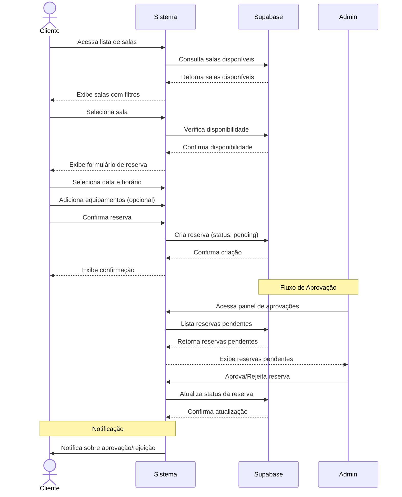
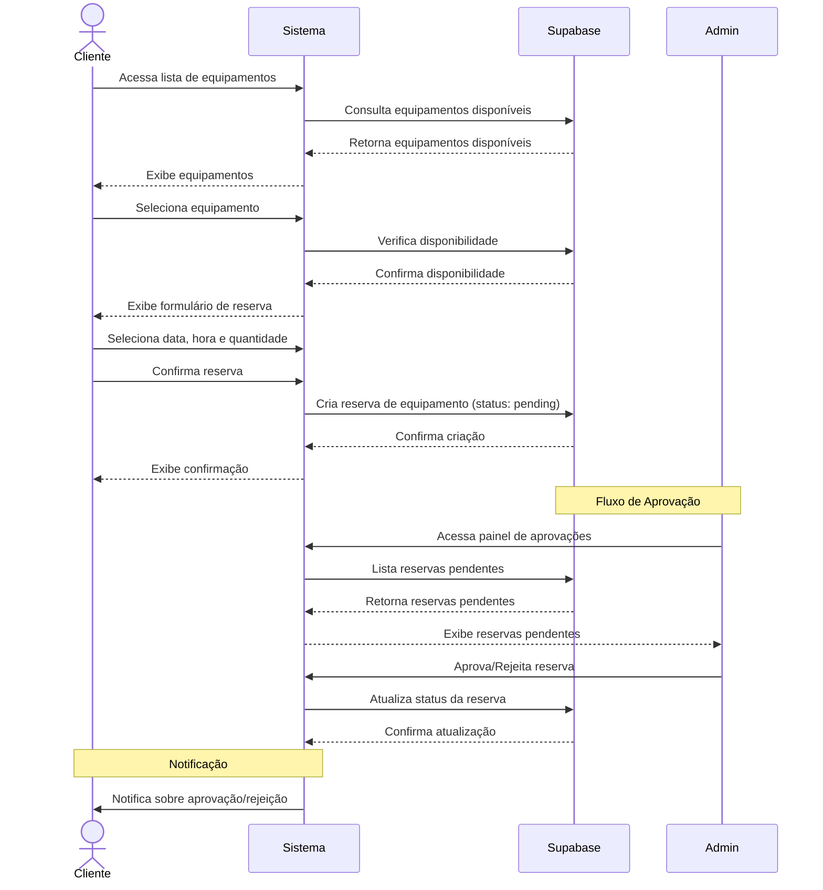
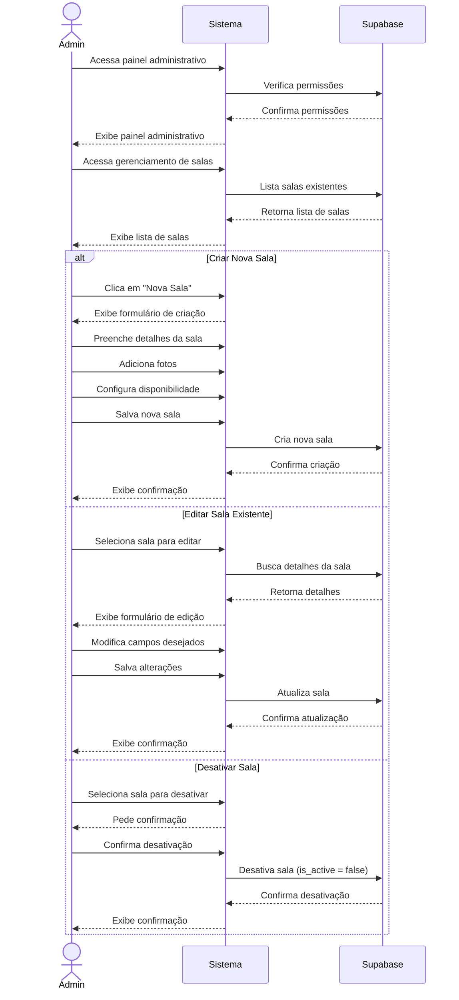
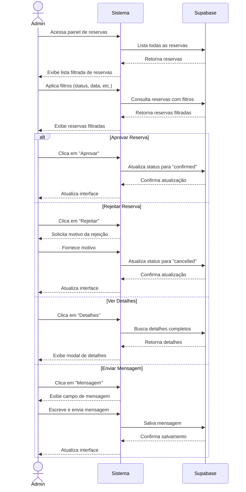
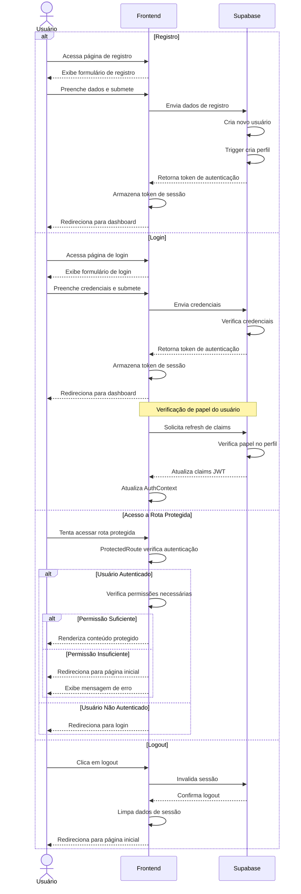

# Fluxos de Reserva do Sistema

## Fluxo de Reserva para Clientes

### Reserva de Sala

### Reserva de Equipamento

## Fluxo para Administradores

### Gerenciamento de Salas

### Gerenciamento de Reservas

## Fluxo de Autenticação e Segurança

